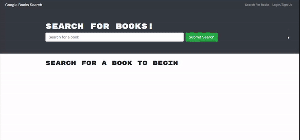

# Google Books Search 
This is an app to search for books using google books api. The users can login and add books that they like to their saved books list or remove them later.

## Built Using
JavaScript, ES6, MongoDB, React, bootstrap, Node.js (Express, Mongoose, graphql, jsonwebtoken, apollo/client, apollo-server-express).

## Table of Contents
* [Usage](#Usage)
* [User-Story](#User-Story)
* [Screenshot](#Screenshot)
* [Deployed](#Deployed)


### Usage
After installing all the dependencies, run ```npm start``` in your terminal to start the application. 

### User-Story
AS AN avid reader<br>
I WANT to search for new books to read<br>
SO THAT I can keep a list of books to purchase<br>


### Screenshot


### Deployed
The application is deployed on Heroku []()

